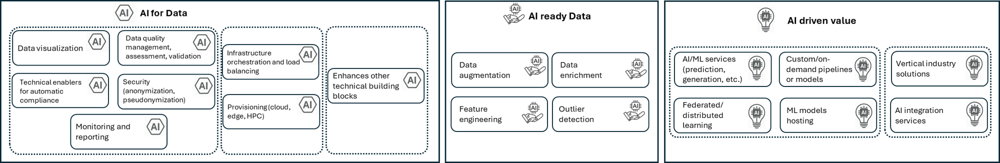
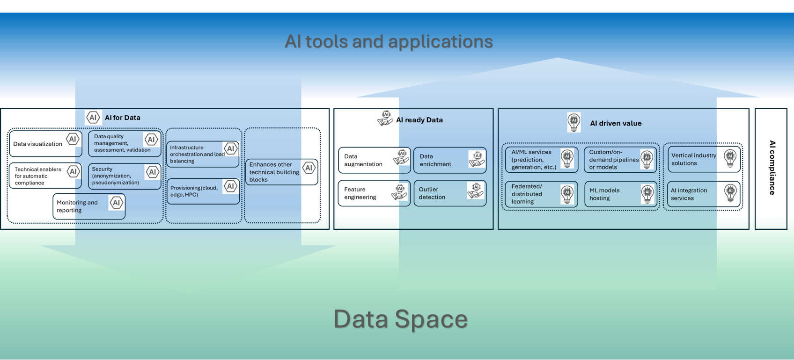

# AI in Data Spaces

The incorporation of AI in data spaces is a multifacet exercise that should cover, at least, the following dimensions:

- AI as a way to reinforce the performance and effectiveness of some technical capabilities around data interoperability, trust, metadata description, publishing, discovery and others. This dimension addresses the so called "AI for Data"
- Refine or complement technical and non-technical capabilities in the data space, for them to meet specific AI-related requirements. This dimension addressed the so called paradigm AI-ready data. 
- Identify specific AI driven value creation services
- Connecting with the previous point, accomoddate AI driven use cases
- Be aware of the regulatory compliance of these AI driven capabilities, specially in view of AI Act
- Experimentation and sandboxing aroind AI in the data space

## AI into DSSC blueprint
As a simple and first approach, we propose for most of these aspects to be centralized in the services offering of the data space (the so called value creation services). This is shown in the following figure, when we use some of the Data Spaces Support Centre buiding blocks (https://dssc.eu/space/BVE2/1071252426/Building+Block+Overview) as reference:

In this way, the DSSC "Value Creation Services" building block can accomodate AI driven services that enhance the functionalities of other technical building blocks (AI for Data) (following the approach in the seminal paper by Ed Curry et al ("Foundation Data Space Models: Bridging the Artificial Intelligence and Data Ecosystems", 2023 IEEE International Conference on Big Data), as, for example, providing:
- LLMs applied to support semantic interoperability (according to the state of the art, as it was gathered in the workshop co-organized by BDVA and SEMIC here: https://bdva.eu/news/success-of-the-semic-bdva-workshop-on-llms-semantic-interoperability/)
- LLMs applied to automatic metadata generation
- AI applied to advanced data cataloguing and discovery 
- AI Agents applied to data traceability 
With this, other technical building blocks can focus on their core capabilities, regardless whether they are powered or not by AI, and link with the Value Creation Services when needed.

Additionally, this  offering can also includes services specifically aimed to prepare data for its use by AI practicioners and applications (AI-ready data):
- Data augmentation
- Data enrichment
- Outliers detection
- Features enginering

Finally, value creation services catalogue can also include AI driven services or services specifically conceived to serve AI applications and AI driven use cases, hence the link with the "Use Case Development" building block. 
All these services must be compliant with AI Act and other regulations, therefore a clear link between this building block and the one on "Regulatory Compliance"

## New proposed taxonomy of Value Creation Services 
Taking all the above into account, we propose a new taxonomy of DSSC Value Creation Services, that captures the previously mentioned aspects, while keeping the same categories as in previous version of DSSC blueprint v2.0, and  with just some small changes and refinements:

- A new subcategory "Enhancement of other technical building blocks" is added under "Core Services", to accomodate those services (AI driven or not), that support other technical buidling blocks
- Some new subcategories are included under "Data Handling Services", specially aimed to prepare data for AI
- We have reorganized the subcategories to cluster services powered by, or supporting, AI, to have a clearer view of AI dimension
- We proposed to use "AI labels" to tag services according to:
  - What categories that can be powered by AI
  - What categories prepare data for AI
  - What categories are AI driven or support AI applications / use cases

## Interface layer between Data Spaces and Artificial Intelligence (applications and services)
In the previous sections, we have explained:
- How AI capabilities can be centralized and accomodated as part of the services offering of the data space, in connection with other technical and non-technical building blocks
- How these capabilities can be integrated in the taxonomy of these services, taking the DSSC Value Creation Services taxonmy, as defined in its corresponding building block of blueprint v2.0, as a reference
Taking all this into account, and by clustering those services incorporating or providing AI capabilities, we can define a layer in the data space that connects with AI tools and applications, as it is shown in the figure below:

By incporporating functionalities from the data space to ensure compliance of the components of this layer to AI regulation (mostly AI Act), this layer will act as interface between Data Spaces and AI tools and applications, enabling a flow in both directions, as showed in the picture below:

